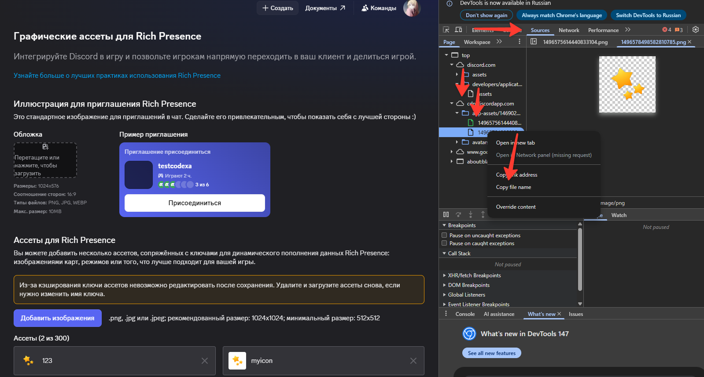

# Discord Userbot

Простой selfbot с командами статуса, AI-ответами и ротацией **кастомного статуса** (из окна "Настроить статус").

Этот selfbot создан как гибкий центр управления аккаунтом Discord: статусы `playing/streaming` настраиваются в конфиге и включаются одной командой, AI-ответы работают прямо из чата, а ротация кастомного статуса поддерживает текст и эмодзи через API. Вся логика разделена на понятные конфиги, чтобы менять поведение без правок кода и без перезапуска.

Ключевая идея проекта — предсказуемость и контроль. Вместо хаотичных ручных команд бот использует строгую конфигурационную схему: если режим не настроен, он не запускается и сразу показывает понятную причину. Это снижает ошибки, ускоряет настройку и делает поведение бота стабильным даже при частых перезагрузках конфигов на лету (`.reloadcfg`).

## Что умеет
- `.status playing` — включить игровой статус из `game.json`
- `.status streaming` — включить стрим-статус из `game.json`
- `.status off` — убрать активность
- `.reloadcfg all|config|game` (или `.reload`) — перезагрузка конфигов без рестарта
- `.help` с категориями команд
- `.ai <текст>` — ответ AI через OnlySQ API
- Авто-ротация текста кастомного статуса

## Файлы
- `app.py` — основной код
- `config.json` — токен, префикс, AI, ротация текста кастомного статуса
- `game.json` — настройки игровых/стрим-статусов и автозапуска
- `config.example.json` — пример `config.json`
- `game.example.json` — пример `game.json`

## 1) Настройка config.json
Пример:

```json
{
  "token": "YOUR_TOKEN_HERE",
  "prefix": ".",
  "owner_id": 0,
  "ai": {
    "enabled": true,
    "allow_others": false,
    "endpoint": "https://api.onlysq.ru/ai/v2",
    "api_key": "openai",
    "model": "gpt-4o-mini",
    "timeout_seconds": 40,
    "max_reply_chars": 1800,
    "system_prompt": ""
  },
  "status_rotation": {
    "enabled": false,
    "interval_seconds": 60,
    "texts": [
      "Текст 1",
      "Текст 2"
    ],
    "custom_emoji": {
      "enabled": false,
      "emoji_name": "",
      "emoji_id": ""
    }
  }
}
```

Пояснения:
- `token` — токен аккаунта
- `prefix` — префикс команд
- `owner_id`:
  - `0` = владелец определится автоматически
  - число > 0 = фиксированный ID владельца
- `status_rotation.texts` — тексты для ротации **кастомного статуса**
- `status_rotation.custom_emoji.enabled`:
  - `false` — эмодзи не ставится
  - `true` — эмодзи ставится вместе с текстом
- `status_rotation.custom_emoji.emoji_name` — обязательно при `enabled=true`
- `status_rotation.custom_emoji.emoji_id`:
  - пусто для обычного unicode-эмодзи (например `emoji_name: "🔥"`)
  - заполни ID для кастомного/премиум эмодзи
- `ai.system_prompt` — системный промпт, задающий стиль/поведение AI-ответов

## 2) Настройка game.json
Пример:

```json
{
  "startup": {
    "game": false,
    "stream": true
  },
  "game": {
    "name": "BeamNG.drive",
    "application_id": 123456789012345678
  },
  "stream": {
    "name": "Live now",
    "application_id": 123456789012345678,
    "image": "myicon",
    "url": "https://www.youtube.com/watch?v=q74fX9CnqtQ"
  }
}
```

Пояснения:
- `startup.game/startup.stream` — что включать при запуске
- Если оба `true`, приоритет у `stream`
- `game`:
  - `name` — название активности
  - `application_id` — ID приложения
- `stream`:
  - `name` — название стрима
  - `application_id` — ID приложения
  - `image` — ключ/ID картинки
  - `url` — ссылка стрима (обязательно)

## Как получить ID картинки (image ID)
Если тебе нужен именно **ID картинки** (а не название), сделай так:

1. Открой Discord в браузере (`https://discord.com/developers/applications/`) - (выбери там сразу твоего новое приложение или создай) -> (там зайди в `Reach Prisense -> Графические ассетсы`) и загрузи его туда.
2. Открой DevTools (`F12`) -> вкладка `Sources`  
3. Открой `cdn.discordapp.com` там будут находятся твои файлы (зеленая икнока) с цифрами. Те цифры и есть нужный айди 
4. Ткни по нужно картинке в откроется предпросмотр и там же где нажали на нее нажмите `Copy file name`  
5. Вставь этот ID в `game.json -> stream.image`  

Пример:


## Команды
- `.help`
  - Показывает версию и категории
- `.help activity`
  - Команды активности
- `.help tools`
  - Команды инструментов
- `.help ai`
  - Команды/настройки AI
- `.status playing`
  - Берет настройки только из `game.json -> game`
- `.status streaming`
  - Берет настройки только из `game.json -> stream`
- `.status off`
  - Убирает активность
- `.reloadcfg all`
  - Перезагружает оба конфига
- `.reloadcfg config`
  - Перезагружает только `config.json`
- `.reloadcfg game`
  - Перезагружает только `game.json`
- `.ai <текст>`
  - Отправляет запрос в OnlySQ и отвечает в чат

## Важно
- Если режим не настроен в `game.json`, команда `.status ...` покажет ошибку и попросит настроить конфиг.
- Ротация меняет только **кастомный статус** из окна "Настроить статус".
- Для кастомного/премиум эмодзи ротация использует поля `emoji_name` + `emoji_id` в `custom_status` (Для него обязателен дискорд нитро или как вариант использовать самые обычные эмодзи доступные всем.).

## Запуск
```bash
pip install discord.py-self requests
python app.py
```


## Дисклеймер
Используете софт полностью на свой страх и риск.
Автор не несет ответственности за любые последствия: ограничения аккаунта, временные блокировки, перманентные баны, потерю доступа или любые другие санкции со стороны Discord.

Что важно понимать заранее:
- Начальные конфиги выставлены как наиболее стабильные для обычного использования.
- Любые изменения таймингов, ротации, AI-логики, частоты запросов и статусов повышают риск флагов.

Используя этот проект, вы подтверждаете, что понимаете риски и принимаете их на себя.
